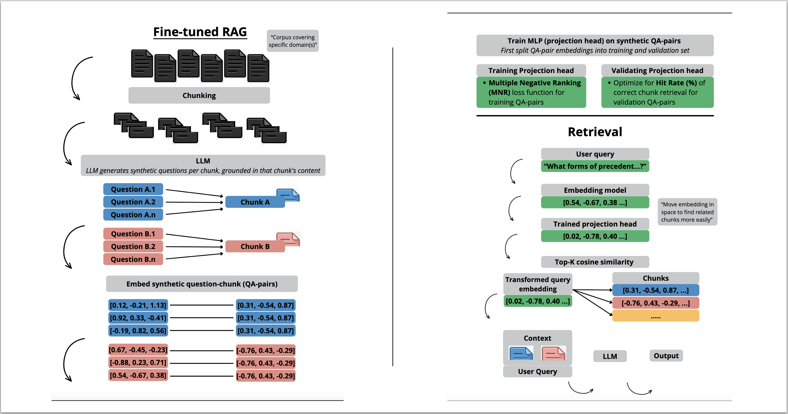
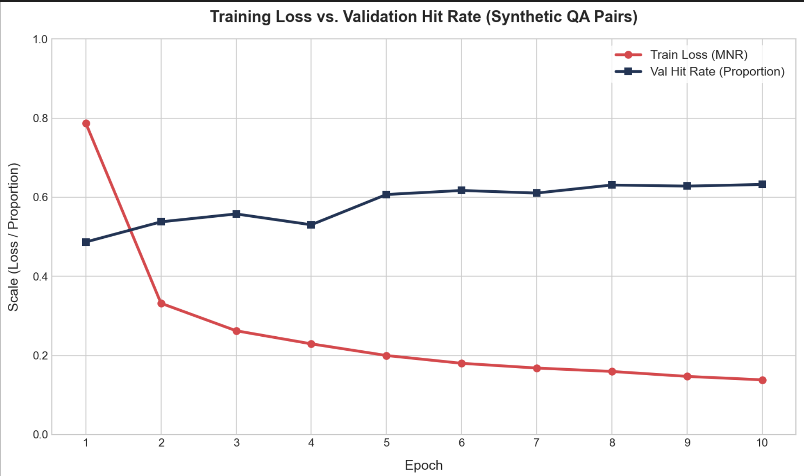
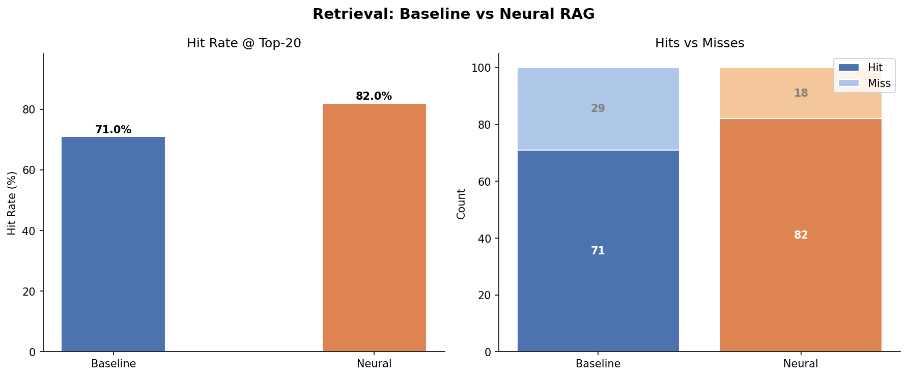
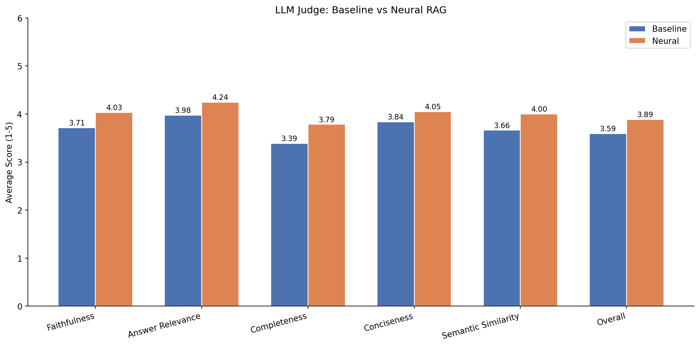

# Fine-tuned RAG

I developed a fine-tuned retrieval head for RAG that learns to more reliably retrieve relevant passages by transforming the query embeddings before retrieval. It is trained on synthetically generated question-chunk pairs from the corpus, and benchmarked against standard top-K cosine similarity on the [`isaacus/legal-rag-bench`](https://huggingface.co/datasets/isaacus/legal-rag-bench) legal corpus.



## Overview

### The Problem with Cosine Top-K Retrieval

Traditional RAG systems retrieve the top-K most similar documents by computing cosine similarity between a query embedding and all document embeddings. The limitation of this approach is that cosine similarity weights every dimension in the embedding space equally. In practice, however, document collections tend to cover specific themes and domains — meaning that only a subset of embedding dimensions are truly informative for matching queries to relevant documents. The remaining dimensions add noise, pulling retrieval toward superficially similar but substantively irrelevant passages.

Consider two hypothetical dimensions in a legal corpus embedding space:

- **Dimension 42** might encode *procedural formality* — capturing whether a passage discusses court procedures, filing rules, or evidentiary standards. For a question about admissibility of evidence, this dimension is highly predictive of the correct chunk.
- **Dimension 317** might encode *geographic references* — capturing whether a passage mentions specific locations or jurisdictions. For most legal reasoning questions, this dimension adds noise rather than signal.

Standard cosine similarity weights both dimensions identically. A query about the burden of proof will retrieve passages that happen to share geographic references with the query, even if those passages are substantively irrelevant — while potentially missing passages that are semantically correct but happen to differ on those noisy dimensions.

**What would result in better retrieval** is a transformation of the query embedding such that dimensions highly predictive of the correct chunk get amplified, and dimensions that don't play a defining role in representing the corpus get suppressed.

---

### The Fine-tuned Retriever

This is exactly what this pipeline does for a RAG that covers a legal domain (as a proof of concept). The approach consists of three stages:

## Method

**1. Synthetic Question Generation**

For each chunk in the training corpus (~4,800 chunks), an LLM (Claude Haiku) generates up to 5 realistic legal questions (similar to potential future user queries) whose answers can be inferred from that chunk (these questions can be found in data/synthethic_questions.xlsx). This produces ~14,000 synthetic question-chunk pairs (referred to as QA-pairs from here on). Questions and chunks are both embedded and split into training and validation QA-pairs, ensuring no chunk appears in both splits.

**2. Neural Net Training and Hyperparameter Optimisation**

A lightweight neural network (separate from the embedding model itself) is trained on the embedded training QA-pairs using **Multiple Negatives Ranking (MNR) Loss**: for each question in a batch, the correct chunk is the positive and all other chunks serve as in-batch negatives. The loss pushes the transformed question embedding close to its correct chunk while pushing it away from all others simultaneously. To handle the fact that multiple synthetic questions may map to the same chunk, a **masking mechanism** ensures these are not penalised as false negatives.

After each epoch, the model is evaluated on the validation QA-pairs by measuring **Hit Rate@5** — the proportion of validation questions for which the correct chunk appears in the top-5 retrieved results. Retrieval works by embedding the question, passing it through the neural network to transform the embedding, and ranking all corpus chunks by cosine similarity to the transformed embedding. [Optuna](https://optuna.org/) (TPE Bayesian optimisation) searches over hyperparameters across multiple trials, saving the checkpoint with the highest validation Hit Rate. This means the saved model is the one that most reliably retrieves the correct chunk — not just the one with the lowest training loss.

The figure below shows for a training iteration how MNR loss and validation hit rate evolve together during training, hinting that the loss is a reliable proxy for retrieval quality:



---

## Results

### Retrieval Hit Rate

The fine-tuned retriever, the one with the highest Hit Rate on the QA-pairs validation set, is evaluated against the baseline (raw embeddings, no transformation) on 100 held-out test questions from the Legal RAG Bench dataset. Hit Rate (k = 20) measures how often the correct chunk appears in the top 20 retrieved results.



The fine-tuned retriever outperforms the baseline, confirming that the learned transformation meaningfully reweights the embedding dimensions in favour of those most predictive for this corpus.

### Answer Quality (LLM as Judge)

Improved retrieval translates into better answers. Both systems use the same LLM and prompt to generate answers from their retrieved context. An LLM judge then scores both answers against the ground truth across six metrics (1–5 scale).



The fine-tuned RAG outperforms the baseline across all six metrics, with the largest gains in completeness (+0.40) and faithfulness (+0.32). The consistent improvement across every metric — rather than isolated gains — suggests that retrieving more relevant context has a broad positive effect on answer quality.

## Repository Structure

```
legal-rag/
├── config.py                   # All constants (model, paths, hyperparameters)
├── src/
│   ├── __init__.py
│   ├── model.py                # NeuralNet, MNRLossWithMasking, EmbeddingDataset
│   ├── train.py                # Training loop, val_hit_rate, Optuna objective
│   ├── retrieval.py            # Top-k retrieval function
│   └── generation.py           # Question generation, answer generation, LLM judge
├── pipeline_generate.py        # Run once: embed corpus, generate QA pairs, save caches
├── pipeline_train.py           # Train neural net on cached QA pairs
├── pipeline_eval.py            # Evaluate retrieval + LLM judge, save plots
├── data/
│   ├── cache_corpus.pkl        # (generated) corpus + embeddings
│   ├── cache_questions.pkl     # (generated) synthetic QA pairs + embeddings
│   └── cache_qa.pkl            # (generated) test QA pairs + embeddings
├── models/
│   └── best_model.pt           # (generated) best neural net checkpoint
└── results/
    ├── retrieval_comparison.png  # (generated) hit rate plot
    ├── judge_comparison.png      # (generated) LLM judge metric plot
    └── evaluation_results.csv    # (generated) per-question scores
```

## Method

### 1. Synthetic QA Generation (`pipeline_generate.py`) (run once — expensive), 
### This will create data/cache_corpus.pkl, cache_questions.pkl, cache_qa.pkl

Run once before training.

```bash
python pipeline_generate.py
```

| Step | Description |
|------|-------------|
| Load corpus | Downloads `isaacus/legal-rag-bench` corpus and QA splits |
| Filter | Removes test chunk IDs from the training corpus |
| Generate questions | Claude Haiku generates up to 5 questions per training chunk |
| Embed | All chunks and questions are encoded with a SentenceTransformer model |
| Save | Caches saved to `data/` as pickle files |

---

### 2. Neural Net Training (`pipeline_train.py`)

| Step | Description |
|------|-------------|
| Split | Training questions split by chunk ID (85% train / 15% validation) |
| Dataset | `EmbeddingDataset` returns `(question_emb, chunk_emb, chunk_id)` per sample |
| Loss | `MNRLossWithMasking` — in-batch negatives with false negative masking |
| Validation | `val_hit_rate` computes Hit Rate@5 on the validation split after each epoch |
| Optimisation | Optuna (TPE) searches hyperparameters across trials, maximising validation Hit Rate |
| Checkpoint | Best model saved to `best_model.pt` with params and hit rate |

**Hyperparameters searched:**

| Parameter | Range |
|-----------|-------|
| `hidden_dim` | 512, 1024, 2048 |
| `num_layers` | 1–3 |
| `dropout` | 0.05–0.3 |
| `lr` | 1e-4–1e-2 (log scale) |
| `temperature` | 0.05–0.2 |
| `batch_size` | 32, 64 |

---

### 3. Evaluation (`pipeline_eval.py`)

For each of the 100 test questions:

1. Retrieve top-20 chunks using both baseline and fine-tuned retriever
2. Generate answers using the retrieved context and Claude Haiku
3. Judge both answers against the ground truth using an LLM judge

**LLM judge metrics (1–5 scale):**

| Metric | Description |
|--------|-------------|
| `faithfulness` | Factual consistency with ground truth |
| `answer_relevance` | Whether the answer directly addresses the question |
| `completeness` | Coverage of key aspects from ground truth |
| `conciseness` | Absence of irrelevant content |
| `semantic_similarity` | Semantic closeness to ground truth |
| `overall` | Holistic quality score |

Running averages are printed after each question. Final results are saved to `evaluation_results.csv`.

---

## Dataset

Both systems are evaluated on `isaacus/legal-rag-bench`, a benchmark for legal retrieval-augmented generation. The corpus covers Australian criminal law topics including:

- Jury directions (Jury Directions Act 2015)
- Evidence law (Evidence Act 2008)
- Criminal offences and defences (Crimes Act 1958)
- Procedure, mental impairment, and sentencing

---

## Setup

### Requirements

```bash
pip install -r requirements.txt
```

### Environment

Create a `.env` file:

```
CLAUDE_API_KEY=your_key_here
```

### Configuration (`config.py`)

Key settings:

```python
EMBED_MODEL = "microsoft/harrier-oss-v1-0.6b"   # SentenceTransformer model
LLM_MODEL   = "claude-haiku-4-5"                # Anthropic model for generation and judging
DIM         = 1024                              # Embedding dimension
TOP_K       = 20                                # Documents retrieved per query
EPOCHS      = 20                                # Max training epochs per trial
N_TRIALS    = 500                               # Optuna trials
PATIENCE    = 5                                 # Early stopping patience
```